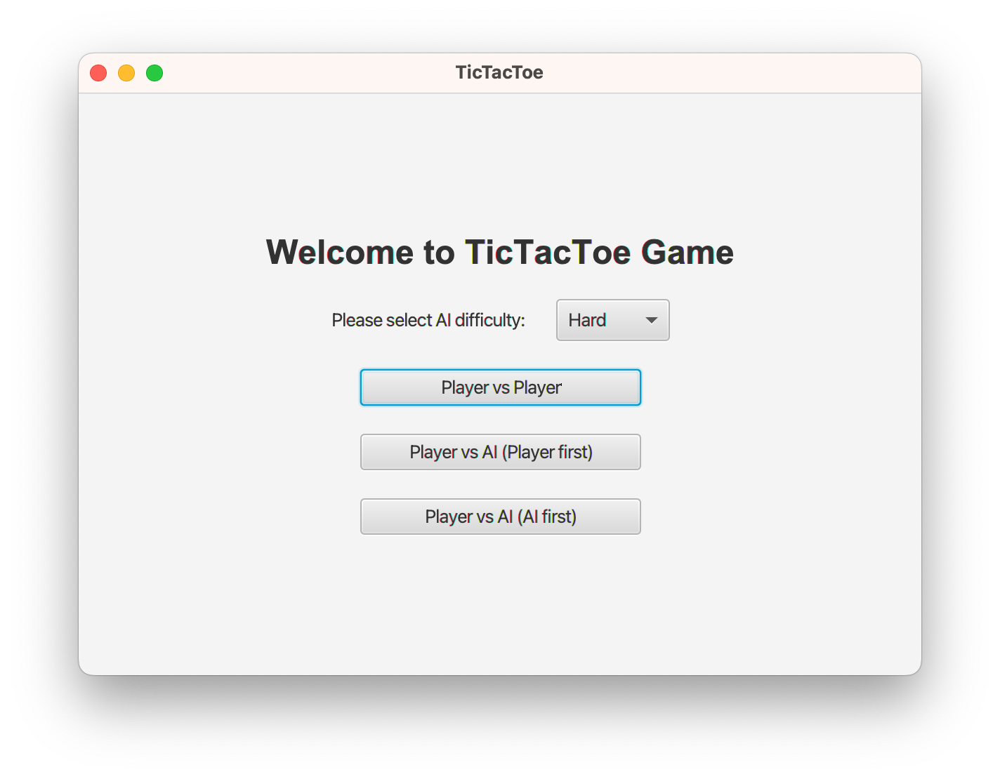
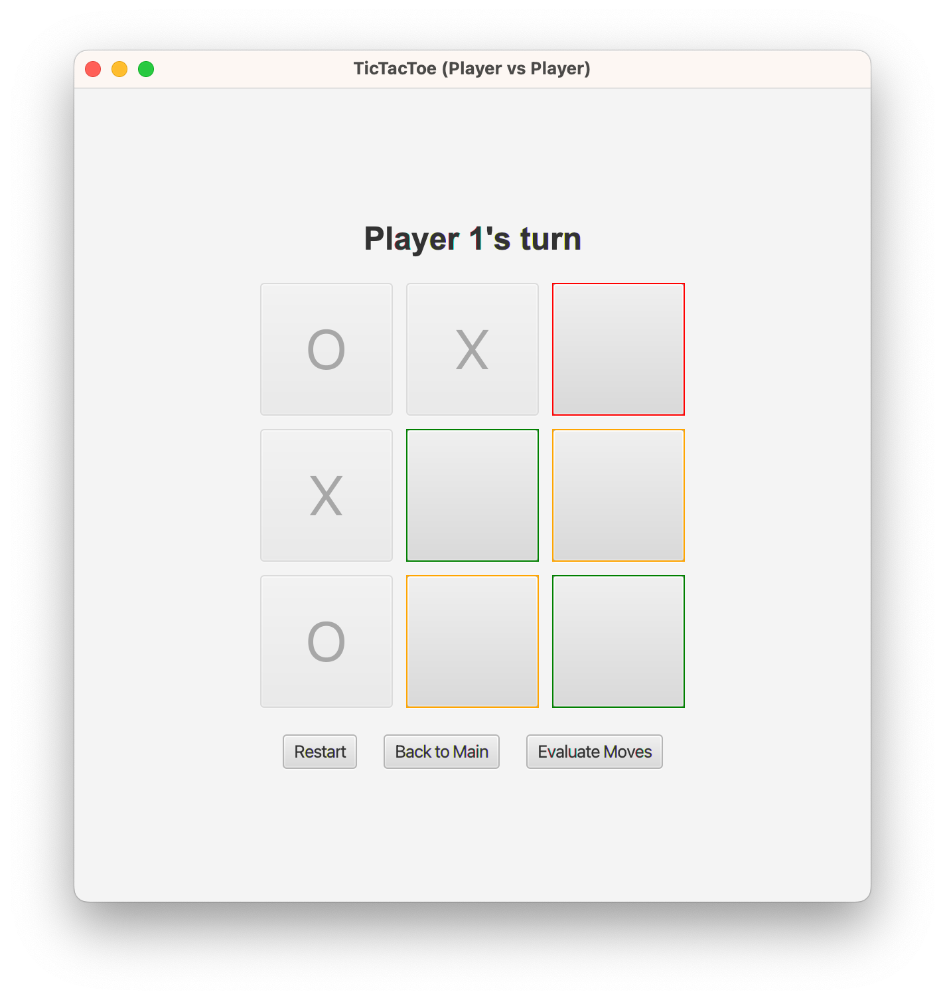

# TicTacToe Minimax

A tic-tac-toe game with minimax computer strategy and GUI (javafx).



To run the game:
```shell
./gradlew run
```

## Features

#### Moves Evaluation (Visualisation)

> 🔴 (Red): will lose if opponent playing a "perfect game"
>
> 🟠 (Orange): will draw if opponent playing a "perfect game"
>
> 🟢 (Green): will win if player playing a "perfect game"


